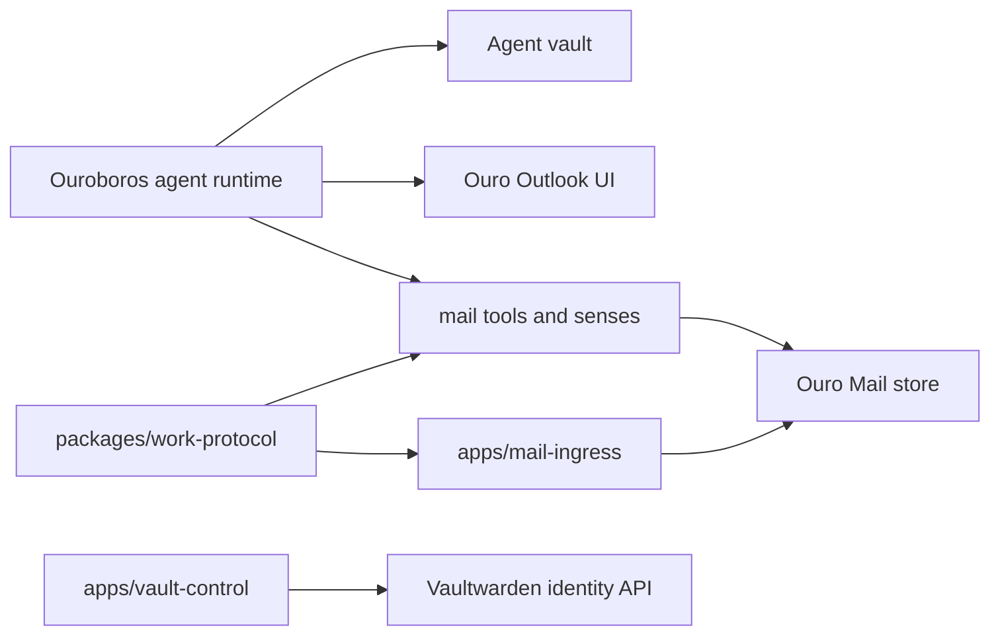

# Architecture

Ouro Work gives each agent a private work account. Mail and vault are coupled because they share identity, setup, access policy, audit, and operator expectations.

## Trust Shape

- Agents can receive mail at their native `agent@ouro.bot` address.
- Delegated human mail enters through explicit source grants such as `me.mendelow.ari.slugger@ouro.bot`.
- The hosted ingress stores encrypted message bodies and raw MIME. Private keys live in the agent vault, not in the hosted service.
- Unknown native inbound mail lands in Screener. Discard means "move to a recoverable drawer", not reject or bounce.
- Vault account creation is a control-plane action. It is authenticated, rate-limited, domain-limited, and designed to avoid logging secrets.

## Repository Boundary

The harness may retain local development stores and readers, but hosted service source belongs in this repository.

## Mail Data Model

Mail storage has two layers:

- **Public routing metadata:** agent id, mailbox id, placement, source grant, sender policy decision, timestamps, raw size, raw hash.
- **Private encrypted payloads:** raw MIME and parsed private envelope, encrypted with the registered public key for the mailbox or delegated source.

This keeps hosted ingress capable of routing and storing mail without being able to read mail content.

## Vault Control Model

`apps/vault-control` receives authenticated requests from an Ouro control plane or trusted operator automation. It creates Vaultwarden accounts via the Bitwarden registration protocol and returns only operational status. The caller owns generated passwords and stores them in the agent vault; the control service does not persist them.

