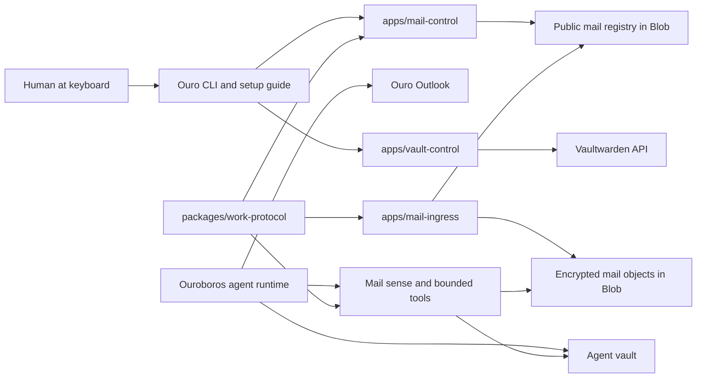

# Architecture

Ouro Work gives each agent a private work account. The first account surfaces are mail and vault, and they are intentionally coupled: identity, setup, private keys, access policy, audit, and recovery all belong to the same story.

The architecture should feel like a well-lit workroom. Public services handle public work. Private secrets stay with the owning agent. The path from "a message arrived" to "the agent can reason about it" is explicit enough to debug without turning the hosted service into a private-data reader.

## One Sentence Model

Mail ingress can route and encrypt mail, Mail Control can create routing records, Vault Control can create work accounts, and only the local agent with vault-held keys can read private mail content.

## System Map

The local Ouroboros harness may keep development stores, mail readers, setup orchestration, senses, and UI. Hosted service source belongs here.

## Trust Shape

- Agents can receive mail at their native `agent@ouro.bot` address.
- Delegated human mail enters through explicit source grants such as `me.mendelow.ari.slugger@ouro.bot`.
- Hosted ingress stores encrypted raw MIME and encrypted parsed private envelopes.
- Private keys live in the owning agent vault, not in the hosted service.
- Mail Control writes the public registry and returns newly generated private keys exactly once.
- Unknown native inbound mail lands in Screener.
- Discard means "move to a recoverable drawer", not reject or bounce.
- Vault account creation is authenticated, rate-limited, domain-limited, and designed to avoid logging secrets.

## Mail Control

`apps/mail-control` is the scalable mailbox onboarding path. It owns no durable private keys.

On each ensure request it:

1. Loads the current public registry.
2. Adds a native mailbox if the agent does not have one.
3. Adds a delegated source grant if requested.
4. Writes the updated registry.
5. Returns only the newly generated private keys in the response.

The caller must write those private keys into the owning agent vault before reporting setup complete. A second identical ensure call should be boring: same mailbox, same alias, no new private keys.

## Mail Data Model

Mail storage has two layers:

- **Public routing metadata:** agent id, mailbox id, placement, source grant, sender policy decision, timestamps, raw size, raw hash.
- **Private encrypted payloads:** raw MIME and parsed private envelope, encrypted with the registered public key for the mailbox or delegated source grant.

This keeps hosted ingress capable of routing and storing mail without being able to read mail content.

## Placement Model

Mail placement is part of the agent experience, not just storage bookkeeping.

- `imbox`: mail the agent can treat as screened-in and relevant.
- `screener`: mail from a sender/source that needs a decision.
- `discarded`: mail set aside in a recoverable drawer.
- `quarantine`: mail held because something about it is suspicious or malformed.
- `draft` and `sent`: outbound records once sending is explicitly enabled.

Native mailbox mail defaults to Screener. Delegated source-grant mail can default to Imbox because the human explicitly created the source grant.

## Vault Control Model

`apps/vault-control` receives authenticated requests from an Ouro control plane or trusted operator automation. It creates Vaultwarden accounts via the Bitwarden registration protocol and returns only operational status.

The caller owns generated passwords and stores them in the agent vault. The control service does not persist them, and logs must never carry them.

## Scaling Shape

The hosted pieces scale independently:

- Mail ingress scales wider for inbound SMTP volume.
- Mail Control scales modestly because mailbox setup is idempotent and low-volume.
- Vault Control scales modestly because account creation is rare and sensitive.
- Blob Storage is the durable mailbox store and public registry backing store.

This gives the system room to grow from one beloved agent to many agents without inventing a separate onboarding or storage model later.
